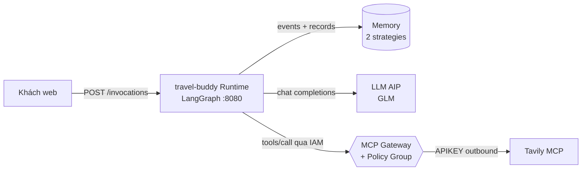

# 🧭 Travel Buddy — Trợ lý du lịch có trí nhớ

> Sample **end-to-end** trên **GreenNode AgentBase**: Agent Runtime (LangGraph) + **Memory** (2 strategies) + **MCP Gateway** (IAM + Policy) + **LLM AIP**. Scaffold chạy được local **và** deploy thẳng lên tài khoản AgentBase của bạn.

📚 [Sơ đồ kiến trúc tương tác](docs/architecture.html) · 🇻🇳 Tài liệu tiếng Việt

---

## ✨ Trải nghiệm chính — agent *nhớ* bạn

| Bạn nói (user `alice`, session 1) | Agent làm gì (tự động) |
|---|---|
| "Mình thích biển, ăn chay, ngân sách 5 triệu, đi Đà Nẵng tháng 6" | 🔍 Tavily search qua **MCP Gateway** → gợi ý lịch trình + weather • 🧠 `remember` → lưu sở thích • Memory engine tự sinh records (CUSTOM + SEMANTIC) |
| Quay lại **session khác** (ngày sau): "Kỳ này đi đâu hợp nhỉ?" | ✨ Callout "**Agent vừa nhớ lại**" trên UI • trả lời theo đúng sở thích cũ — **không cần nhắc lại** |

UI 3 cột (dark theme): **Người dùng/Phiên** · **Chat** (markdown, callout ✨ khi agent nhớ) · **Bộ nhớ** (records theo từng strategy, refresh tự động).

## 🏗 Kiến trúc



- **Runtime** — `src/backend`: SDK `GreenNodeAgentBaseApp`, agent = `create_agent` + MCP tools + 2 memory tools; headers `X-GreenNode-AgentBase-User-Id/-Session-Id` tách bộ nhớ theo user.
- **Memory** — 1 memory, 2 long-term strategies: `user-preferences` (**CUSTOM**, extraction prompt riêng) + `trip-facts` (**SEMANTIC**). Checkpointer `AgentBaseMemoryEvents` lưu hội thoại; namespace `/strategies/<id>/actors/<userId>`.
- **MCP Gateway** — `sample-mcp-gw`, inbound **IAM**, connector `tavily` (outbound APIKEY). **Policy Group** `sample-gw-policy`: chỉ travel-buddy được 5 action Tavily, còn lại **deny mặc định** (đã verify: token lạ → "Request denied by policy").
- **Frontend** — `src/frontend`: vanilla SPA, backend serve tại `GET /` (same-origin, không CORS).

## 📁 Cấu trúc

```
├── src/backend/          # main.py (routes) · agent.py (LangGraph) · memory_tools.py · mcp_client.py
├── src/frontend/         # index.html · style.css · app.js (không build step)
├── docs/architecture.html  # sơ đồ tương tác (mở bằng browser)
├── Dockerfile · .env.example · requirements.txt
```

## 🚀 Chạy local

```bash
cp .env.example .env       # điền giá trị — xem bảng Env reference bên dưới
docker build -t travel-buddy . && docker run -p 8080:8080 --env-file .env travel-buddy
# mở http://localhost:8080
```

## ☁️ Deploy lên GreenNode AgentBase — qua Portal (UI)

Portal: **https://aiplatform.console.vngcloud.vn** → menu *AI Platform / AgentBase*. Tên menu có thể khác nhẹ theo phiên bản console; mỗi bước kèm API tương đương để đối chiếu.

### Bước 1 — LLM API key (LLM AIP / Model Access)
1. Portal → **LLM / Model Access** (hoặc *API Keys*) → **Create API Key** → copy key `lap-…`.
2. API: `POST /llm/api/v1/api-keys` (xem `GET /llm/api/v1/models` để chọn model, ví dụ `z-ai/glm-5.3-flash`).

### Bước 2 — Tạo Memory
1. Portal → **Memory** → **Create Memory** → đặt tên `travel-buddy-memory`.
2. Thêm **2 long-term strategies**:
   - `user-preferences` — type **CUSTOM**, dán *extraction prompt*: *"Rút trích sở thích du lịch của người dùng: loại hình (biển/núi...), ăn uống (chay/cay/food-hunting), ngân sách, điểm đến dự định, ngày đi. Mỗi record 1 câu tiếng Việt."*
   - `trip-facts` — type **SEMANTIC**, auto-generate ON, expiry 30 days.
3. Copy **Memory ID** (`memory-…`) và 2 **Strategy ID** (`ltms-…`).
4. API: `POST /memory/memories` với `longTermMemoryStrategies: [{name, type: "CUSTOM"|"SEMANTIC", customFactExtractionPrompt?, autoGenerate: true, expiryDays: 30}]`.

### Bước 3 — Tạo MCP Gateway + connector
1. Portal → **MCP Gateway / Resource Gateway** → **Create Gateway**: tên `sample-mcp-gw`, inbound auth **IAM**, Public endpoint, flavor nhỏ nhất.
2. Sau khi gateway **ACTIVE** → **Add Custom Connector** (nút *Connect*): modal điền
   - **Name**: `tavily`
   - **Type**: `MCP`
   - **Endpoint / Connect URL**: `https://mcp.tavily.com/mcp/`
   - **Outbound auth**: `APIKEY` → flow **2LO**, provider tạo mới `tavily-apikey`, *API key* = key Tavily của bạn (tavily.com), header `Authorization`, prefix `Bearer `
3. Lấy **Gateway URL** (dạng `https://gw-<tên>-<id>.agentbase-gateway.…vn`) → URL cho agent là `<gateway>/tavily`.
4. API: `POST /gateway/api/v1/gateways` → `PATCH /gateway/api/v1/gateways/sample-mcp-gw` với `targets:[{name:"tavily",type:"MCP",endpoint:"https://mcp.tavily.com/mcp/",outboundAuth:{type:"APIKEY",flow:"2LO",providerName:"tavily-apikey",headerName:"Authorization",headerValuePrefix:"Bearer "}}]`.

### Bước 4 — Policy Group (bảo vệ gateway)
1. Deploy agent trước (Bước 5) rồi gọi `POST /invocations {"op":"whoami"}` trên endpoint runtime để lấy `token_sub` của agent.
2. Portal → **Policy** → **Create Policy Group** `sample-gw-policy` → thêm policy:
   - `allow-travel-tavily` — effect **allow** · principal `iam:<token_sub-của-runtime>` · actions `tavily__tavily_search`, `tavily__tavily_extract`, `tavily__tavily_crawl`, `tavily__tavily_map`, `tavily__tavily_research` · resources `gateway:sample-mcp-gw`
3. Quay lại **Gateway** → gắn **Policy Group** vừa tạo. Từ đây: caller không có policy → *"Request denied by policy."*
4. API: `POST /policy/api/v1/policy-groups` → `POST /policy/api/v1/policy-groups/<gid>/policies` → `PATCH /gateway/api/v1/gateways/sample-mcp-gw {"policyGroupId":"…"}`.

### Bước 5 — Deploy runtime
1. Build & push image: `docker build -t <registry>/travel-buddy:v1 . && docker push …` (registry **vCR** của dự án; `docker login` theo hướng dẫn Portal → Container Registry).
2. Portal → **AgentBase / Agents** → **Create Agent (Custom)**: name `travel-buddy`, image vừa push, flavor `runtime-s2-general-2x4`, và **Environment variables** theo bảng bên dưới (**không cần** `GREENNODE_CLIENT_ID/SECRET` — runtime tự inject service account).
3. Mở **endpoint URL** → giao diện chat hiện ngay (`GET /`).
4. CLI: `runtime.sh create --name travel-buddy --image … --flavor runtime-s2-general-2x4 --from-cr --env-file .env.deploy`.

## 🔧 Env reference

| Biến | Bắt buộc | Ý nghĩa |
|---|---|---|
| `LLM_API_KEY` | ✅ | LLM AIP key (`lap-…`) |
| `LLM_MODEL` | ✅ | ví dụ `z-ai/glm-5.3-flash` |
| `AGENTBASE_MEMORY_ID` | ✅ | `memory-…` tạo ở Bước 2 |
| `MEMORY_STRATEGY_PREF_ID` | ✅ | strategy `user-preferences` (CUSTOM) |
| `MEMORY_STRATEGY_FACTS_ID` | ✅ | strategy `trip-facts` (SEMANTIC) |
| `MCP_TAVILY_URL` | ✅ | `<gateway-url>/tavily` |
| `GREENNODE_CLIENT_ID/SECRET` | local only | chỉ khi chạy local (runtime đã tự inject) |

## 🔌 API contract (backend tự expose)

| Method | Path | Mô tả |
|---|---|---|
| POST | `/invocations` | body `{"message":"…"}` + headers `X-GreenNode-AgentBase-User-Id`, `-Session-Id` → `{"response", "memories_used":[…]}`. `{"op":"whoami"}` → identity của runtime |
| GET | `/api/memory?actor=<user>` | records theo 2 strategy |
| GET | `/api/history?actor=&session=` | hội thoại (events `conversational`) |
| GET | `/api/actors` | danh sách user + sessions |
| GET | `/api/info` · `/health` | cấu hình · health |

## ✅ Đã verify E2E (tài khoản mẫu)

- Gateway `sample-mcp-gw` + connector `tavily` ACTIVE · Policy deny mặc định hoạt động (token lạ → *"Request denied by policy."*)
- 2 user (`alice` — biển/chay/5tr; `ba` — núi/street-food/4tr) → 2 kế hoạch khác nhau, memory panel hiển thị records theo strategy.
- Kiểm tra nhanh sau khi deploy của bạn:
  ```bash
  curl -X POST "<endpoint-runtime>/invocations" \
    -H "Content-Type: application/json" \
    -H "X-GreenNode-AgentBase-User-Id: alice" -H "X-GreenNode-AgentBase-Session-Id: s1" \
    -d '{"message":"Mình thích biển, ăn chay, ngân sách 5 triệu, đi Đà Nẵng tháng 6"}'
  ```

## 💰 Chi phí & dọn dẹp

- Runtime chạy **real wallet** (~1 replica × 2x4). Xoá: Portal → Agents → Delete; CLI `runtime.sh delete <runtime-id>`. Dọn sạch: skill `agentbase-teardown`.

