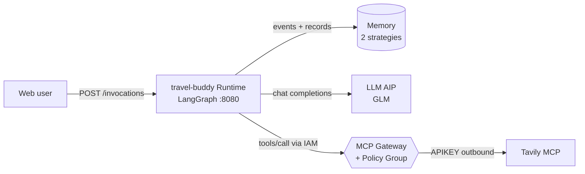
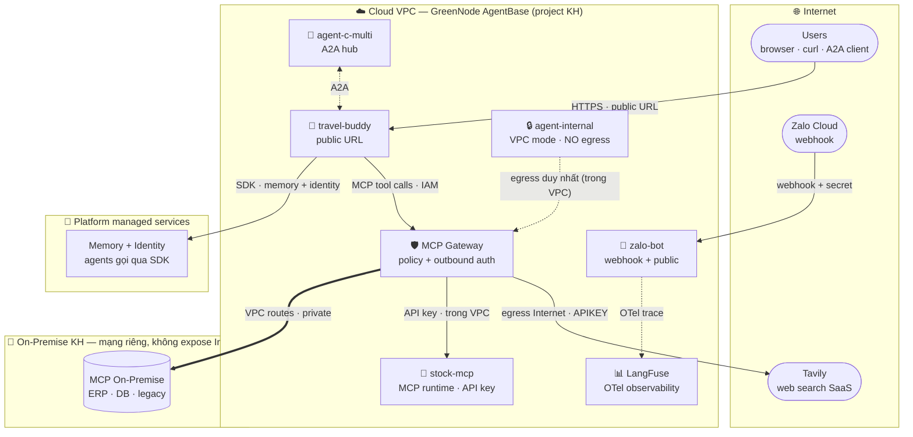

# 🧭 Travel Buddy — A Travel Assistant with Memory

[](https://github.com/GreenNode-Sample-AgentBase/greennode-agentbase-travel-buddy/actions/workflows/ci.yml)
[](LICENSE)

> An **end-to-end** sample on **GreenNode AgentBase**: Agent Runtime (LangGraph) + **Memory** (2 strategies) + **MCP Gateway** (IAM + Policy) + **LLM AIP**. Runs locally out of the box **and** deploys straight to your own AgentBase account.

📚 [Interactive architecture diagram](docs/architecture.html) · 🇻🇳 Hướng dẫn tiếng Việt xem trong lịch sử repo

## 🔗 Live demo (public endpoints)

| What | URL |
|---|---|
| **Chat UI** (open in browser) | https://endpoint-5bd80bd4-183e-4157-a004-9df9b1d24cd1.agentbase-runtime.aiplatform.vngcloud.vn/ |
| REST API | https://endpoint-5bd80bd4-183e-4157-a004-9df9b1d24cd1.agentbase-runtime.aiplatform.vngcloud.vn/invocations |
| Health | https://endpoint-5bd80bd4-183e-4157-a004-9df9b1d24cd1.agentbase-runtime.aiplatform.vngcloud.vn/health |

> Endpoint lives on the demo account — it may be taken down after the demo period; deploy your own with Step 5 below.

---

## ✨ The experience — the agent *remembers* you

| You say (user `alice`, session 1) | What the agent does (automatically) |
|---|---|
| "I love the beach, I'm vegetarian, budget ~5M VND, going to Da Nang in June" | 🔍 Tavily search through the **MCP Gateway** → itinerary + weather • 🧠 `remember` → stores your preferences • the Memory engine auto-extracts records (CUSTOM + SEMANTIC) |
| Return in a **different session** (days later): "Where should I go next?" | ✨ The UI shows an "**Agent just recalled**" callout • the reply matches your earlier preferences — **no need to repeat yourself** |

The 3-column dark UI: **Users/Sessions** · **Chat** (markdown + ✨ memory callout, **token-by-token streaming**) · **Memory** (records grouped per strategy, auto-refresh).

## 🏗 Architecture



- **Runtime** — `src/backend`: the `GreenNodeAgentBaseApp` SDK, agent = `create_agent` + MCP tools + 2 memory tools; the `X-GreenNode-AgentBase-User-Id` / `-Session-Id` headers partition memory per user.
- **Memory** — one memory, 2 long-term strategies: `user-preferences` (**CUSTOM**, dedicated extraction prompt) + `trip-facts` (**SEMANTIC**). Checkpointer `AgentBaseMemoryEvents` stores conversations; namespace `/strategies/<id>/actors/<userId>`.
- **MCP Gateway** — `sample-mcp-gw`, **IAM** inbound, `tavily` connector (APIKEY outbound). **Policy Group** `sample-gw-policy`: only travel-buddy may call the 5 Tavily actions — everything else is **denied by default** (verified: unknown token → "Request denied by policy.").
- **Frontend** — `src/frontend`: vanilla SPA, served by the backend at `GET /` (same-origin, no CORS).

## 🌐 Kiến trúc mạng theo layer — Public · Private · On-Premise

Toàn bộ mô hình kết nối từng thành phần (Memory, MCP Gateway, agents, on-prem) qua các lớp mạng — bản đẹp có theme toggle + export PNG/SVG: **[docs/network-layers.html](docs/network-layers.html)** · bản use-case flows: **[docs/usecase-flows.html](docs/usecase-flows.html)**



**Luồng chính:** user → agent (public URL) → MCP Gateway (IAM + policy) → tool. Gateway là **điểm egress duy nhất**: ra Internet (APIKEY/OAUTH outbound lấy từ Identity) hoặc vào mạng riêng on-premise (VPC routes). Agent VPC mode không có public URL và không tự egress — mọi thứ đi qua gateway trong VPC.

### Use case: đi public vs đi private

| Use case | Agent | Endpoint | Egress của agent | Đường tới tool |
|---|---|---|---|---|
| **Public demo** | travel-buddy · zalo-bot · agent-c-multi | public URL (HTTPS), IAM/API-key tùy cấu hình | Internet **qua gateway** (agent không egress trực tiếp) | gateway → Internet (tavily, APIKEY) hoặc trong VPC (stock-mcp, API key) |
| **Private agent** | `agent-internal` — runtime **VPC mode** (`networkConfig`: `mode`/`vpcId`/`subnetId`/`routeCidrs`) | **không có** public URL — chỉ nhận traffic nội bộ VPC | **không Internet** — egress duy nhất là gateway | gateway → MCP trong VPC hoặc route CIDRs sang on-prem |
| **MCP on-premise** | mọi agent (qua gateway) | MCP KHÔNG expose Internet | — | gateway **route CIDRs** sang mạng on-premise KH (site-to-site trong VPC) |
| **A2A** | mọi agent | `/a2a` (public URL hoặc internal) | theo mode của agent | JSON-RPC `message/send` agent ↔ agent, không cần SDK chung |

> **Ghi chú minh bạch:** travel-buddy / agent-c-multi / zalo-bot / stock-mcp / LangFuse là **bản demo đang chạy live** (public mode). `agent-internal` (VPC mode) và **MCP on-premise** là 2 pattern private của platform — cấu hình qua runtime `networkConfig` và gateway VPC routes — chưa kết nối mạng on-premise thật trong demo này.

## 📁 Layout

```
├── src/backend/          # main.py (routes) · agent.py (LangGraph) · memory_tools.py · mcp_client.py
├── src/frontend/         # index.html · style.css · app.js (no build step)
├── docs/architecture.html  # interactive diagram (open in a browser)
├── Dockerfile · .env.example · requirements.txt
```

## 🚀 Run locally

```bash
cp .env.example .env       # fill values — see the Env reference below
docker build -t travel-buddy . && docker run -p 8080:8080 --env-file .env travel-buddy
# open http://localhost:8080
```

## ☁️ Deploy to GreenNode AgentBase — via the Portal (UI)

Portal: **https://aiplatform.console.vngcloud.vn** → *AI Platform / AgentBase*. Menu names may differ slightly per console version; each step also lists the equivalent API.

### Step 1 — LLM API key (LLM AIP / Model Access)
1. Portal → **LLM / Model Access** (or *API Keys*) → **Create API Key** → copy the `lap-…` key.
2. API: `POST /llm/api/v1/api-keys` (see `GET /llm/api/v1/models` to pick a model, e.g. `z-ai/glm-5.3-flash`).

### Step 2 — Create Memory
1. Portal → **Memory** → **Create Memory** → name it `travel-buddy-memory`.
2. Add **2 long-term strategies**:
   - `user-preferences` — type **CUSTOM**, paste this *extraction prompt*: *"Extract the user's travel preferences: style (beach/mountain...), food (vegetarian/spicy/street food), budget, planned destination and dates. One Vietnamese sentence per record."*
   - `trip-facts` — type **SEMANTIC**, auto-generate ON, 30-day expiry.
3. Copy the **Memory ID** (`memory-…`) and both **Strategy IDs** (`ltms-…`).
4. API: `POST /memory/memories` with `longTermMemoryStrategies: [{name, type: "CUSTOM"|"SEMANTIC", customFactExtractionPrompt?, autoGenerate: true, expiryDays: 30}]`.

### Step 3 — Create the MCP Gateway + connector
1. Portal → **MCP Gateway / Resource Gateway** → **Create Gateway**: name `sample-mcp-gw`, inbound auth **IAM**, public endpoint, smallest flavor.
2. Once the gateway is **ACTIVE** → **Add Custom Connector** (the *Connect* button): fill the modal with
   - **Name**: `tavily`
   - **Type**: `MCP`
   - **Endpoint / Connect URL**: `https://mcp.tavily.com/mcp/`
   - **Outbound auth**: `APIKEY` → flow **2LO**, create provider `tavily-apikey`, *API key* = your Tavily key (tavily.com), header `Authorization`, prefix `Bearer `
3. Copy the **Gateway URL** (`https://gw-<name>-<id>.agentbase-gateway.…vn`) → the agent's URL is `<gateway>/tavily`.
4. API: `POST /gateway/api/v1/gateways` → `PATCH /gateway/api/v1/gateways/sample-mcp-gw` with `targets:[{name:"tavily",type:"MCP",endpoint:"https://mcp.tavily.com/mcp/",outboundAuth:{type:"APIKEY",flow:"2LO",providerName:"tavily-apikey",headerName:"Authorization",headerValuePrefix:"Bearer "}}]`.

### Step 4 — Policy Group (protect the gateway)
1. Deploy the agent first (Step 5), then call `POST /invocations {"op":"whoami"}` on the runtime endpoint to get the agent's `token_sub`.
2. Portal → **Policy** → **Create Policy Group** `sample-gw-policy` → add a policy:
   - `allow-travel-tavily` — effect **allow** · principal `iam:<runtime-token_sub>` · actions `tavily__tavily_search`, `tavily__tavily_extract`, `tavily__tavily_crawl`, `tavily__tavily_map`, `tavily__tavily_research` · resources `gateway:sample-mcp-gw`
3. Back on the **Gateway**, attach the policy group. From then on any caller without a policy → *"Request denied by policy."*
4. API: `POST /policy/api/v1/policy-groups` → `POST /policy/api/v1/policy-groups/<gid>/policies` → `PATCH /gateway/api/v1/gateways/sample-mcp-gw {"policyGroupId":"…"}`.

### Step 5 — Deploy the runtime
1. Build & push the image: `docker build -t <registry>/travel-buddy:v1 . && docker push …` (your project's **vCR** registry; `docker login` per the Portal → Container Registry instructions).
2. Portal → **AgentBase / Agents** → **Create Agent (Custom)**: name `travel-buddy`, the image above, flavor `runtime-s2-general-2x4`, and **environment variables** per the table below (**no** `GREENNODE_CLIENT_ID/SECRET` needed — the runtime injects its service account).
3. Open the **endpoint URL** → the chat UI appears immediately (`GET /`).
4. CLI alternative: `runtime.sh create --name travel-buddy --image … --flavor runtime-s2-general-2x4 --from-cr --env-file .env.deploy`.

## 🔧 Env reference

| Variable | Required | Meaning |
|---|---|---|
| `LLM_API_KEY` | ✅ | LLM AIP key (`lap-…`) |
| `LLM_MODEL` | ✅ | e.g. `z-ai/glm-5.3-flash` |
| `AGENTBASE_MEMORY_ID` | ✅ | `memory-…` created in Step 2 |
| `MEMORY_STRATEGY_PREF_ID` | ✅ | the `user-preferences` strategy (CUSTOM) |
| `MEMORY_STRATEGY_FACTS_ID` | ✅ | the `trip-facts` strategy (SEMANTIC) |
| `MCP_TAVILY_URL` | ✅ | `<gateway-url>/tavily` |
| `GREENNODE_CLIENT_ID/SECRET` | local only | only for local runs (the runtime injects them) |
| `AGENT_API_KEY` | optional | if set, `/invocations` + `/api/*` require the `X-API-Key` header (stops strangers burning your LLM credits). **Leave it unset for a frictionless demo** — the bundled UI never asks for a key |
| `DEBUG_OPS` | default `0` | `1` enables the `{"op":"whoami"}` identity op — only while setting up policies |

## 🔌 API contract (exposed by the backend)

| Method | Path | Description |
|---|---|---|
| POST | `/invocations` | body `{"message":"…"}` + headers `X-GreenNode-AgentBase-User-Id`, `-Session-Id` → `{"response", "memories_used":[…]}`. `{"op":"whoami"}` → the runtime's identity (needs `DEBUG_OPS=1`) |
| POST | `/api/chat/stream` | same body/headers → **SSE token stream** (`{"type":"token"|"done"|"error"}`) — the UI uses this with automatic fallback to `/invocations` |
| GET | `/api/memory?actor=<user>` | records grouped by the 2 strategies |
| GET | `/api/history?actor=&session=` | conversation (events of type `conversational`) |
| GET | `/api/actors` | users and their sessions |
| GET | `/api/info` · `/health` | config · health |
| GET | `/ready` | deep readiness: memory + gateway + LLM (200 ok / 503 degraded) |

## ✅ Verified end-to-end (demo account)

- Gateway `sample-mcp-gw` + `tavily` connector ACTIVE · default-deny policy works (unknown token → *"Request denied by policy."*)
- Two users (`alice` — beach/vegetarian/5M; `ba` — mountain/street food/4M) → two different plans, the memory panel shows records per strategy.
- Quick check after your own deploy:
  ```bash
  curl -X POST "<runtime-endpoint>/invocations" \
    -H "Content-Type: application/json" \
    -H "X-GreenNode-AgentBase-User-Id: alice" -H "X-GreenNode-AgentBase-Session-Id: s1" \
    -d '{"message":"I love the beach, I am vegetarian, budget 5M VND, going to Da Nang in June"}'
  ```

## 🤝 A2A protocol (agent-to-agent)

Agent này là một **A2A server** — agent khác discovery và gọi nó theo chuẩn A2A (không cần SDK riêng):

| Endpoint | Method | Nội dung |
|---|---|---|
| `/.well-known/agent-card.json` | GET | Agent card: name, skills (`travel-planning`, `personalization`), capabilities (streaming ✔), URL |
| `/a2a` | POST | JSON-RPC 2.0 `message/send` → trả `Message` chuẩn A2A (contextId + parts text) |
| `/a2a` | POST | `message/stream` → SSE: status-update working → artifact-update (token) → completed |

- Endpoint A2A **mở** (không qua `X-API-Key`) — đó là điểm thiết kế cho agent discovery.
- `contextId` của A2A map thẳng vào `thread_id` → cuộc trò chuyện A2A **có memory** như chat thường.
- Test nhanh:
  ```bash
  curl -s $ENDPOINT/.well-known/agent-card.json | jq '.name, .skills[].id'
  curl -s -X POST $ENDPOINT/a2a -H 'Content-Type: application/json' -d \
    '{"jsonrpc":"2.0","id":"1","method":"message/send","params":{"message":{"kind":"message","messageId":"m1","role":"user","parts":[{"kind":"text","text":"Đi Đà Lạt 3 ngày nên ở khu nào?"}]}}}' | jq -r '.result.parts[0].text'
  ```
- Unit tests: `tests/test_a2a.py` (card shape, trích text từ parts, envelope JSON-RPC).

## 📊 Observability — LangFuse v4 (OTel SDK)

Mọi turn (chat + A2A + stream) đều được trace bằng **LangFuse SDK v4** (`langfuse>=4.0,<5`):

- Pattern: `_lf_scope()` (`propagate_attributes`) **bao ngoài** turn → trace name / user / session / tags áp cho root **và mọi child observation** (kể cả generation chịu chi phí); `_lf_callback()` (CallbackHandler OTel) tạo **bên trong** scope.
- Bật chỉ cần 3 env: `LANGFUSE_PUBLIC_KEY`, `LANGFUSE_SECRET_KEY`, `LANGFUSE_HOST`. Thiếu env → tracing tự tắt, agent chạy bình thường (`nullcontext`).
- Trong UI LangFuse sẽ thấy: model + token usage từng generation, tool calls (`tavily_search`, `recall`), cây LangGraph, session/user/tags để lọc.

## 🛡️ Production hardening

The sample ships with these guards — flip them on when deploying publicly:

| Guard | How |
|---|---|
| **API key on the endpoint** | set `AGENT_API_KEY=<random>` in the runtime env → `X-API-Key` required on `/invocations` + `/api/*` (for API clients; the live demo runs without it so the UI is zero-friction) |
| **Hide runtime identity** | keep `DEBUG_OPS=0` (default) — `whoami` is disabled after policy setup |
| **Policy on the gateway** | already enforced: only this runtime's principal may call `tavily__*` (deny by default) |
| **Context budget** | the agent trims history to the last 40 messages (cuts at human-message boundaries, keeps the system prompt) |
| **Transient failures** | gateway calls retry with backoff on connect errors/5xx (idempotent calls); `recall` degrades gracefully instead of failing the turn |
| **Timezone** | "today" in the system prompt uses `Asia/Ho_Chi_Minh`, not container UTC |
| **Readiness probe** | `GET /ready` checks memory + gateway + LLM — wire it to your monitor |

## 💰 Cost & teardown

- Runtimes run on the **real wallet** (~1 replica × 2x4). Delete: Portal → Agents → Delete; CLI `runtime.sh delete <runtime-id>`. Full cleanup: the `agentbase-teardown` skill.

