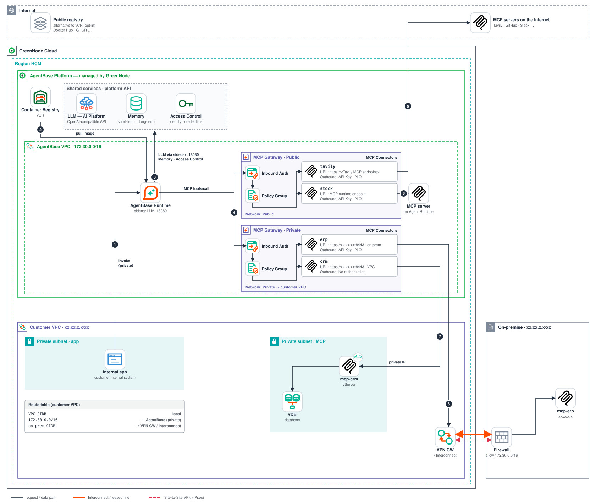
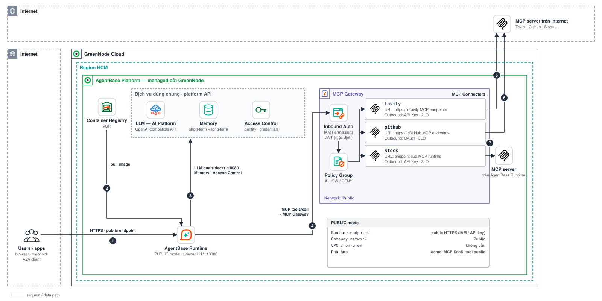
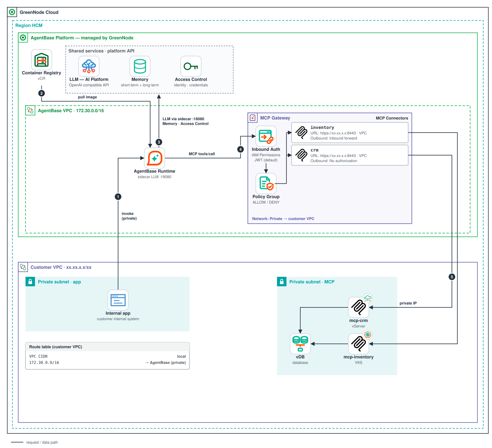
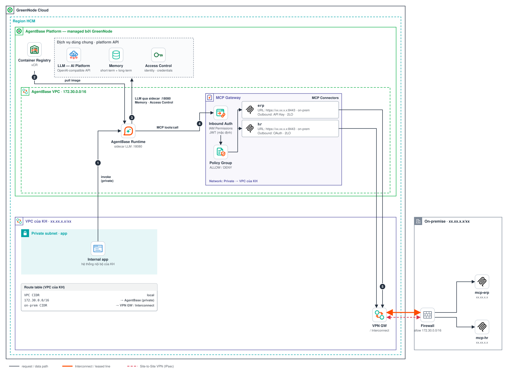
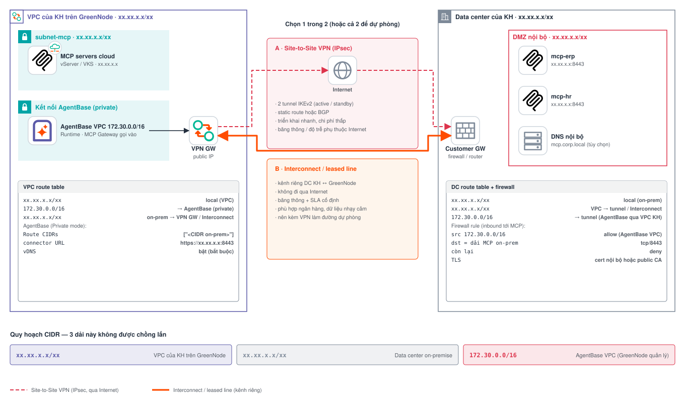

# Kết nối mạng của AgentBase

Tài liệu này trả lời 3 câu hỏi KH hay hỏi khi đưa agent lên **GreenNode AgentBase**:

1. **Agent Runtime chạy ở đâu, image lấy từ đâu?**
2. **Từ Runtime, LLM / Memory / Access Control được gọi qua đường nào?**
3. **MCP Gateway và MCP Connector hoạt động ra sao, và agent gọi tới MCP server (Internet, Cloud, on-premise) bằng đường mạng nào?**

Diagram bố cục theo style AWS Architecture Diagram, dùng bộ icon chính thức của GreenNode ([`icons/`](icons/)) và logo MCP; sinh bằng [`build_diagrams.py`](build_diagrams.py) (`python3 docs/network/build_diagrams.py`). Các dải `xx.xx.x.x/xx` là placeholder. Nội dung bám theo docs: [AgentBase](https://docs.greennode.ai/ai-stack/agent-base) · [MCP Governance](https://docs.greennode.ai/ai-stack/agent-base/mcp-governance) · [MCP Gateway](https://docs.greennode.ai/ai-stack/agent-base/mcp-governance/mcp-gateway) · [MCP Connectors](https://docs.greennode.ai/ai-stack/agent-base/mcp-connectors) · [Private Networking](https://docs.greennode.ai/ai-stack/agent-base/private-networking).

---

## Mô hình

| Thành phần | Nằm ở đâu | Vai trò |
|---|---|---|
| **Agent Runtime** | **AgentBase VPC** (`172.30.0.0/16`) do GreenNode quản lý | Chạy agent. Network **Public** (qua public gateway dùng chung của AgentBase) hoặc **Private** (chọn VPC + Subnet + Route CIDRs của KH → đi qua **VPC Peering**) |
| **Sidecar LLM Proxy** | Tự inject vào agent (`localhost:18080`) | Mọi LLM call đi qua sidecar, không đi qua MCP Gateway |
| **Container Registry (vCR)** | AgentBase Platform, private per org | Runtime pull image agent từ vCR. KH có thể dùng **public registry** (Docker Hub, GHCR…) thay vCR nếu đồng ý pull qua Internet |
| **Memory · Access Control** | AgentBase Platform | Memory (short-term + long-term) và Access Control (Agent Identity, credentials API Key / OAuth2) gọi qua SDK |
| **MCP Gateway** | **AgentBase VPC** (managed) | **Proxy cho mọi MCP tool call**: Inbound Auth (IAM Permissions / JWT) → Policy Group (ALLOW / DENY) → MCP Connector. Network **Public**, hoặc **Private** (VPC + Subnet + Route CIDRs của KH, qua VPC Peering) |
| **MCP Connector** | Trong MCP Gateway | Mỗi connector = 1 MCP server: **MCP endpoint URL** + **Outbound Auth** (OAuth / API Key 2LO·3LO, Inbound forward, No authorization). Secret lấy từ Access Control |
| **VPC Peering** | Giữa AgentBase VPC và VPC của KH | Kết nối private **hai chiều**, không qua Internet. Phải thiết lập trước khi dùng mode Private — **liên hệ GreenNode support để kích hoạt** |
| **MCP server** | Internet · AgentBase Runtime · VPC của KH · On-premise | Gateway gọi tới theo URL của connector. MCP private: gateway Private → VPC Peering → VPC của KH; on-prem thì đi tiếp qua S2S VPN / Interconnect (phía KH) |

Luồng gọi tool theo docs: **Agent → MCP Gateway (Inbound Auth) → Policy Group → MCP Connector (Outbound Auth) → MCP Server.**

Agent Runtime và MCP Gateway **không chạy trong VPC của KH**: chúng nằm trong AgentBase VPC, và mode Private chỉ nối mạng sang VPC của KH qua VPC Peering.

---

## 01 · Bản đồ kết nối tổng



| # | Luồng | Đi qua đâu |
|---|---|---|
| 1 | Internal app → Agent Runtime | App nội bộ trong VPC của KH gọi agent qua VPC Peering (Runtime mode Private) |
| 2 | vCR → Runtime | Pull image agent (hoặc public registry nếu KH đồng ý) |
| 3 | Runtime → LLM, Memory, Access Control | LLM qua Sidecar LLM Proxy `:18080`; Memory, Access Control qua SDK |
| 4 | Runtime → MCP Gateway | MCP `tools/call`; gateway xác thực Inbound Auth rồi kiểm tra Policy Group |
| 5 | Gateway Public · connector `tavily` → MCP trên Internet | Outbound API Key |
| 6 | Gateway Public · connector `stock` → MCP chạy trên Agent Runtime | Ví dụ sample `greennode-agentbase-sample-mcp-stock-server` |
| 7 | Gateway Private · connector `crm` → MCP trong VPC của KH | Gateway Private → VPC Peering → IP private trên vServer / VKS |
| 8 | Gateway Private · connector `erp` → MCP on-premise | Gateway Private (Route CIDRs = CIDR on-prem) → VPC Peering → VPC của KH → VPN GW / Interconnect → firewall DC |

> Hình vẽ **2 gateway**: gateway Private chỉ đi mạng private (docs: *"Internal — never leaves the private network"*), nên connector ra Internet (`tavily`) và MCP có endpoint public (`stock`) đặt ở 1 gateway **Public** riêng. Agent dùng được cả 2 gateway.

---

## Use case Public · Agent Runtime PUBLIC mode (demo hiện tại)



Bối cảnh: agent phục vụ user trên Internet và chỉ dùng tool public (MCP SaaS như Tavily, GitHub, hoặc MCP server chạy trên AgentBase Runtime). Không cần VPC hay kết nối on-prem. Đây là mô hình sample travel-buddy đang chạy.

| # | Luồng |
|---|---|
| 1 | User / app trên Internet gọi endpoint public của Agent Runtime (HTTPS, IAM / API key) |
| 2 | Runtime pull image từ vCR |
| 3 | Runtime gọi LLM (sidecar `:18080`) / Memory / Access Control |
| 4 | Runtime gọi MCP Gateway → Inbound Auth → Policy Group |
| 5 | Connector `tavily` → MCP trên Internet (API Key) |
| 6 | Connector `github` → MCP trên Internet (OAuth 3LO, user consent) |
| 7 | Connector `stock` → MCP server chạy trên AgentBase Runtime |

```jsonc
// Agent Runtime — bỏ trống networkConfig = PUBLIC (mặc định)

// MCP Gateway
"networkMode": "PUBLIC",
"inboundAuth": { "mode": "IAM" },
"targets": [
  { "name": "tavily", "type": "MCP", "endpoint": "https://<Tavily MCP endpoint>",
    "outboundAuth": { "type": "APIKEY", "flow": "2LO", "headerName": "Authorization",
                      "headerValuePrefix": "Bearer ", "providerName": "tavily-key" } },
  { "name": "github", "type": "MCP", "endpoint": "https://<GitHub MCP endpoint>",
    "outboundAuth": { "type": "OAUTH", "flow": "3LO", "providerName": "github-oauth",
                      "returnUrl": "https://<gateway endpoint>/oauth/return" } }
]
```

---

## Use case A · MCP server nằm trong VPC của KH (không dùng Tavily)



| # | Luồng |
|---|---|
| 1 | App nội bộ trong VPC của KH gọi agent qua VPC Peering |
| 2 | Runtime pull image từ vCR |
| 3 | Runtime gọi LLM (sidecar) / Memory / Access Control |
| 4 | Runtime gọi MCP Gateway → Inbound Auth → Policy Group |
| 5 | Connector `inventory`, `crm` gọi MCP server bằng IP private, qua VPC Peering |

```jsonc
// Agent Runtime
"networkConfig": { "mode": "VPC", "vpcId": "<vpc-đã-peering>", "subnetId": "<subnet-uuid>" }   // = Private trên console

// MCP Gateway
"networkMode": "PRIVATE",
"privateNetwork": { "vpcId": "<vpc-đã-peering>", "subnetId": "<subnet-uuid>" },
"inboundAuth": { "mode": "IAM" },
"targets": [
  { "name": "crm", "type": "MCP", "endpoint": "https://xx.xx.x.x:8443",
    "outboundAuth": { "type": "NONE" } },
  { "name": "inventory", "type": "MCP", "endpoint": "https://xx.xx.x.x:8443",
    "outboundAuth": { "type": "APIKEY", "flow": "2LO", "headerName": "X-Api-Key",
                      "providerName": "inventory-key" } }
]
```

---

## Use case B · MCP server nằm ở on-premise (không dùng Tavily)



| # | Luồng |
|---|---|
| 1 | Runtime pull image từ vCR |
| 2 | Runtime gọi LLM (sidecar) / Memory / Access Control |
| 3 | Runtime gọi MCP Gateway → Inbound Auth → Policy Group |
| 4 | Connector `erp`, `hr` gọi URL private on-prem: gateway (Route CIDRs = CIDR on-prem) → VPC Peering → route table VPC của KH → VPN GW / Interconnect |
| 5 | Qua Interconnect hoặc Site-to-Site VPN tới firewall DC → MCP server |

```jsonc
// MCP Gateway — Private network + route sang on-prem (≤ 50 CIDR, RFC 1918)
"networkMode": "PRIVATE",
"privateNetwork": {
  "vpcId": "<vpc-đã-peering>", "subnetId": "<subnet-uuid>",
  "routes": ["<CIDR on-prem>"]
},
"targets": [
  { "name": "erp", "type": "MCP", "endpoint": "https://xx.xx.x.x:8443",
    "outboundAuth": { "type": "APIKEY", "flow": "2LO", "headerName": "X-Api-Key",
                      "providerName": "erp-mcp-key" } },
  { "name": "hr", "type": "MCP", "endpoint": "https://xx.xx.x.x:8443",
    "outboundAuth": { "type": "OAUTH", "flow": "2LO", "providerName": "hr-oauth",
                      "scopes": ["mcp.invoke"] } }
]
```

---

## 05 · Thông mạng từ on-premise tới VPC của KH trên GreenNode



**Bước 1: Quy hoạch CIDR.** Các dải thực tế đang dùng không được chồng lấn:

| Dải | Giá trị | Ghi chú |
|---|---|---|
| VPC của KH trên GreenNode | `xx.xx.x.x/xx` | subnet cho Agent Runtime, MCP Gateway, MCP cloud |
| Data center on-premise | `xx.xx.x.x/xx` | dải đưa vào **Route CIDRs** của MCP Gateway (và của Runtime nếu agent gọi thẳng) |
| AgentBase VPC | `172.30.0.0/16` | nơi Agent Runtime + MCP Gateway chạy; VPC của KH và DC không được trùng dải này |

**Bước 2: Chọn đường kết nối.**

| | Site-to-Site VPN (IPsec) | Interconnect / leased line |
|---|---|---|
| Đi qua | Internet (mã hóa IPsec) | kênh riêng DC ↔ GreenNode |
| Triển khai | nhanh, cần firewall/router hỗ trợ IPsec | làm việc với GreenNode và nhà mạng |
| Băng thông / độ trễ | phụ thuộc Internet | cố định, có SLA |
| Phù hợp | PoC, workload vừa | ngân hàng, dữ liệu nhạy cảm, tải lớn |

Production nên dùng Interconnect làm đường chính và VPN làm đường dự phòng.

**Bước 3: Route hai đầu.**
- VPC: `<CIDR on-prem> → VPN Gateway / Interconnect`.
- Data center: `<CIDR VPC> → tunnel / Interconnect`.
- VPC của KH: `172.30.0.0/16 → VPC Peering` (tạo khi kích hoạt peering).
- MCP Gateway: **Route CIDRs** = `["<CIDR on-prem>"]`.
- Data center phải route ngược `172.30.0.0/16 → tunnel / Interconnect`, và VPN tunnel phải cho phép dải này (traffic từ gateway mang IP nguồn trong AgentBase VPC — xác nhận với GreenNode nếu có NAT).

**Bước 4: Firewall và TLS.**
- Firewall DC chỉ mở `src 172.30.0.0/16 (AgentBase VPC) → dst <dải MCP on-prem> tcp/8443`, còn lại deny.
- MCP on-prem chạy HTTPS (cert nội bộ hoặc public CA).
- URL connector dùng IP, hoặc tên miền nội bộ nếu VPC đã forward DNS về DNS server của DC.

**Checklist**
- [ ] Đã liên hệ GreenNode support kích hoạt **VPC Peering** giữa VPC của KH và AgentBase VPC
- [ ] VPC bật vDNS, CIDR không trùng `172.30.0.0/16` (`vserver.sh validate-vpc`)
- [ ] Runtime dùng flavor `agent-runtime-vpc`; gateway dùng flavor hỗ trợ `networkMode=PRIVATE`
- [ ] Tunnel / Interconnect đã lên; từ một vServer trong VPC ping được MCP on-prem
- [ ] DC route ngược + firewall đã mở cho `172.30.0.0/16`
- [ ] Policy Group đã attach vào gateway (không attach thì mọi `tools/call` bị 403)

---

## Ghi chú

- Sample travel-buddy đang chạy demo với Runtime PUBLIC, image trên vCR, gateway Public và connector `tavily`. Use case A, B cần `vpcId` / `subnetId` thật và đường kết nối tới DC của KH.
- Nên xác nhận với GreenNode: endpoint gọi agent khi Runtime ở mode Private, gateway Private có ra Internet được không, và traffic qua peering có NAT hay giữ IP nguồn `172.30.x`.
- `xx.xx.x.x/xx` là placeholder: thay bằng dải IP thật. Chỉ `172.30.0.0/16` là giá trị thật (CIDR của AgentBase VPC).
